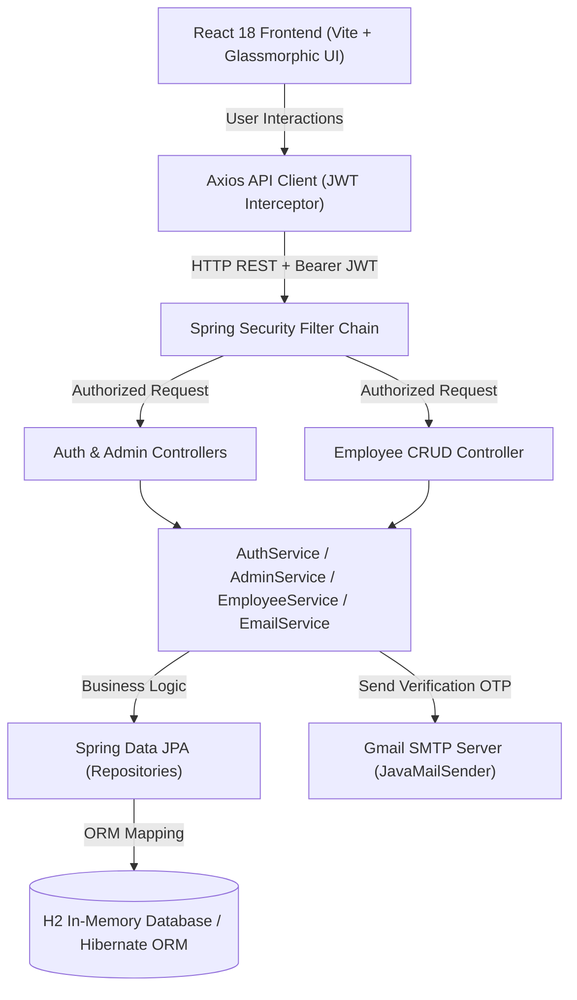

# 🏢 Full-Stack Employee Management & Access Governance System

A modern enterprise-grade **Employee Management System** built with **Spring Boot 3 (Java 17)** and **React 18 (Vite)** featuring **JWT Authentication**, **Role-Based Access Control (RBAC)**, **Admin Approval Workflows**, **Spring Mail OTP Password Resets**, and a **Glassmorphic UI Design System**.

---

## 📌 Project Architecture Overview



---

## 🚀 Key Features

1. **🔒 Secure JWT Authentication**:
   - Stateless JWT tokens (HMAC-SHA256) valid for 24 hours.
   - Spring Security custom filter chain with custom 401 Unauthorized & 403 Access Denied JSON handlers.

2. **🛡️ Admin Registration Approval Workflow**:
   - Standard User registrations start in **`PENDING`** state and are blocked from signing in until approved.
   - **`ADMIN`** users receive real-time badge notifications and can **Approve** or **Decline** requests.
   - Upon approval, the system **automatically generates an active Employee profile** for the user.

3. **🔑 Email OTP Password Reset**:
   - 2-step verification workflow using **Spring Mail (`JavaMailSender`)** and Gmail SMTP.
   - Generates a secure 6-digit numeric OTP valid for 15 minutes.
   - Password fields feature an **Eye button** (`Eye` / `EyeOff` icons) to toggle password visibility.

4. **💼 Employee Workforce Management (CRUD)**:
   - Create, View, Edit, and Delete employee records.
   - Real-time search by First Name, Last Name, or Email.
   - Department filtering (`ENGINEERING`, `HR`, `MARKETING`, `FINANCE`, `SALES`, `OPERATIONS`).
   - Employment status filtering (`FULL_TIME`, `PART_TIME`, `CONTRACT`, `INACTIVE`).

5. **🎨 Modern Glassmorphic Design System**:
   - Dark mode aesthetic with curated HSL color gradients, subtle blur effects, and smooth micro-animations.

---

## 🛠️ Technology Stack

| Layer | Technology / Library | Version | Description |
|---|---|---|---|
| **Backend Framework** | Spring Boot | 3.2.3 | Java 17 core web framework |
| **Security** | Spring Security + JJWT | 0.12.5 | JWT token generation & role authorization |
| **Database** | H2 Database + Spring Data JPA | 3.2.3 | In-memory relational DB & Hibernate ORM |
| **Email Service** | Spring Boot Starter Mail | 3.2.3 | JavaMailSender integration with Gmail SMTP |
| **Frontend Core** | React | 18.2.0 | UI component library |
| **Build Tool** | Vite | 5.1.4 | Lightning-fast HMR frontend build tool |
| **Icons** | Lucide React | 0.344.0 | Modern SVG icon set |
| **HTTP Client** | Axios | 1.6.7 | REST API integration with request interceptors |

---

## 🗄️ Database Schema & Entities

### 1. `users` Table Schema
| Column | Type | Constraints | Description |
|---|---|---|---|
| `id` | BIGINT | PRIMARY KEY, AUTO_INCREMENT | Unique User Identifier |
| `username` | VARCHAR(255) | UNIQUE, NOT NULL | Account Username |
| `email` | VARCHAR(255) | UNIQUE, NOT NULL | User Email Address |
| `password` | VARCHAR(255) | NOT NULL | BCrypt Hashed Password |
| `role` | VARCHAR(255) | NOT NULL | `ROLE_ADMIN` or `ROLE_USER` |
| `status` | VARCHAR(255) | NOT NULL | `APPROVED`, `PENDING`, or `DECLINED` |
| `reset_otp` | VARCHAR(255) | NULLABLE | 6-digit password reset OTP |
| `reset_otp_expiry` | TIMESTAMP | NULLABLE | OTP Expiration timestamp (15 min) |
| `created_at` | TIMESTAMP | NOT NULL | Account creation date |

### 2. `employees` Table Schema
| Column | Type | Constraints | Description |
|---|---|---|---|
| `id` | BIGINT | PRIMARY KEY, AUTO_INCREMENT | Unique Employee ID |
| `first_name` | VARCHAR(255) | NOT NULL | First Name |
| `last_name` | VARCHAR(255) | NOT NULL | Last Name |
| `email` | VARCHAR(255) | UNIQUE, NOT NULL | Employee Email |
| `department` | VARCHAR(255) | NOT NULL | Enum: `ENGINEERING`, `HR`, `MARKETING`, `FINANCE`, `SALES`, `OPERATIONS` |
| `employment_status` | VARCHAR(255) | NOT NULL | Enum: `FULL_TIME`, `PART_TIME`, `CONTRACT`, `INACTIVE` |
| `phone_number` | VARCHAR(255) | NULLABLE | Contact Number |
| `salary` | DOUBLE | NULLABLE | Annual Salary ($) |
| `created_at` | TIMESTAMP | NOT NULL | Record creation date |
| `updated_at` | TIMESTAMP | NULLABLE | Last update date |

---

## 📡 REST API Endpoint Documentation

### 🔓 Public Authentication Endpoints (`/api/auth`)
- `POST /api/auth/register`: Register new user (`ROLE_USER` defaults to `PENDING`).
- `POST /api/auth/login`: Authenticate user and receive JWT bearer token.
- `POST /api/auth/forgot-password`: Request 6-digit OTP sent to registered email.
- `POST /api/auth/reset-password`: Reset password using email, OTP code, and new password.

### 🛡️ Admin Endpoints (`/api/admin`) — *Requires `ROLE_ADMIN`*
- `GET /api/admin/users/pending`: Fetch list of user access requests pending approval.
- `PUT /api/admin/users/{userId}/approve`: Approve user account & auto-create Employee profile.
- `PUT /api/admin/users/{userId}/decline`: Decline user registration request.

### 💼 Employee Management Endpoints (`/api/employees`) — *Protected*
- `GET /api/employees`: List employees with search, department, and status filters.
- `GET /api/employees/{id}`: Fetch single employee details.
- `POST /api/employees`: Create new employee (*ADMIN only*).
- `PUT /api/employees/{id}`: Update employee record (*ADMIN only*).
- `DELETE /api/employees/{id}`: Delete employee record (*ADMIN only*).

---

## ⚡ How to Run Locally

### 1. Prerequisites
- **Java 17 JDK**
- **Maven 3.8+**
- **Node.js 18+ & npm**

### 2. Backend Setup
```bash
cd backend
mvn spring-boot:run
```
*Backend starts on `http://localhost:8080`*. H2 Web Console is available at `http://localhost:8080/h2-console` (`jdbc:h2:mem:employeedb`, User: `sa`, Password: empty).

### 3. Frontend Setup
```bash
cd frontend
npm install
npm run dev
```
*Frontend starts on `http://localhost:3000`*.

---

## 🔑 Default Credentials

- **Admin Account**: Username: `admin` | Password: `admin123`
- **Standard User Account**: Username: `user` | Password: `user123`
